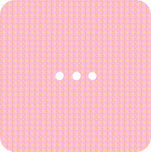
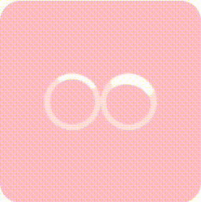
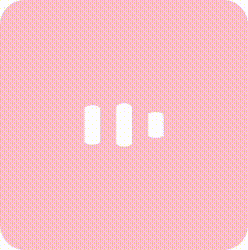
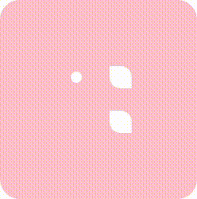
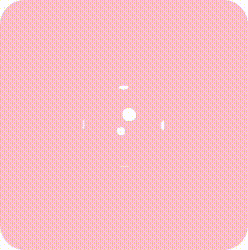
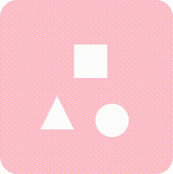

# CSS Playground

## Installation
```shell
yarn
```

## Running
```shell
yarn start
```

## Content
- **Loader** (3 balls switching)



- **LoaderCircle** (just circle loader)



- **LoaderDiagram** (3 sticks pulsing)



- **LoaderSquare** (1 circle and 2 lemons in square. Yes.)



- **LoaderCube** (Round cube spinning)



- **LoaderSTC** (Square, Triangle, Circle animation)

